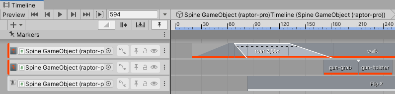
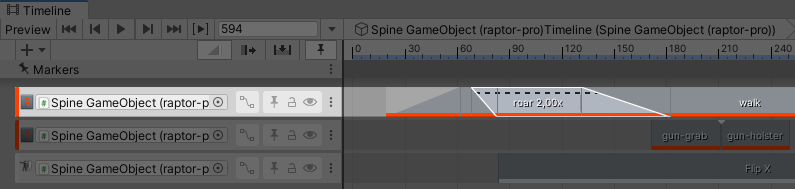

The latest version of this documentation can also be found at the [spine-unity Runtime Documentation](http://esotericsoftware.com/spine-unity#Timeline-Extension-UPM-Package) webpage.

# Timeline Extension UPM Package

Timeline support is provided as a separate UPM (Unity Package Manager) package. See section [Optional Extension UPM Packages](http://esotericsoftware.com/spine-unity#Optional-Extension-UPM-Packages) on how to download and install this package and section [Updating an Extension UPM Package](http://esotericsoftware.com/spine-unity#Updating-an-Extension-UPM-Package) on how to update it.

## Spine-Unity Timeline Playables

Spine Timeline currently provides three types of Timeline Playables:  
- `Spine AnimationState Track` *(for `SkeletonAnimation`)*,
- `Spine AnimationState Graphic Track` *(for `SkeletonGraphic`)*,
- `Spine Skeleton Flip Track` *(for both `SkeletonAnimation` and `SkeletonGraphic`)*.

**Limitations:** currently only [SkeletonAnimation](http://esotericsoftware.com/spine-unity#SkeletonAnimation-Component) and [SkeletonGraphic](http://esotericsoftware.com/spine-unity#SkeletonGraphic-Component) are supported. There is currently no Timeline support for [SkeletonMecanim](http://esotericsoftware.com/spine-unity#SkeletonMecanim-Component).

### Spine AnimationState Track

  

This track type can be used to set animations at the AnimationState of the target `SkeletonAnimation` or `SkeletonGraphic`. Track type `Spine AnimationState Track` is used for `SkeletonAnimation`, `Spine AnimationState Graphic Track` for `SkeletonGraphic`.

  

**Parameters**
- *Track Index.* The target AnimationState track index to set animations at. Do not forget to set this value accordingly when using multiple timeline tracks.
> **Important Note:** Currently it is required to order the timeline tracks with base track at the top and overlay tracks below, otherwise the Editor Preview will display incorrect results.

#### Spine Animation State Clip

You can add a `Spine Animation State Clip` to a `Spine AnimationState Track` (or `Spine AnimationState Graphic Track`) by dragging an `AnimationReferenceAsset` onto a Timeline track. See the [SkeletonData - Preview](http://esotericsoftware.com/spine-unity#Preview) section on how to generate `AnimationReferenceAssets` for a `SkeletonDataAsset`.

  

**Parameters**
- *Clip In.* An initial local start time offset applied when playing this animation. Can also be adjusted by dragging the left edge of the clip.
- *Ease In Duration.* Blend transition duration used when `Use Blend Duration` and `Custom duration` are enabled. Can be adjusted by  moving the clip into the previous clip, resulting in a cross-fade triangle at the transition.
- *Speed Multiplier.* Playback speed multiplier. When set to 2.0 it will play the animation twice as fast, when set to 0.5 half as fast.
- *Custom duration.* When enabled, the value under `Mix Duration` below is used for transitions from the previous animation to this animation. When disabled, it will use the setup `Mix Duration` value at the SkeletonData asset for the animation pair.
- *Use Blend Duration.* When enabled, the value under `Mix Duration` will be synced with the timeline clip transition duration 'Ease In Duration'. Enable this value to adjust transition durations by moving the clip into the previous clip, resulting in a cross-fade triangle at the transition.
- *Mix Duration.* When *Custom duration* is enabled, this mix duration is used for transitions from the previous animation to this animation.
- *Event Threshold.* See [TrackEntry.EventThreshold](http://esotericsoftware.com/spine-api-reference#TrackEntry-eventThreshold).
- *Attachment Threshold.* See [TrackEntry.AttachmentThreshold](http://esotericsoftware.com/spine-api-reference#TrackEntry-attachmentThreshold).
- *Draw Order Threshold.* See [TrackEntry.DrawOrderThreshold](http://esotericsoftware.com/spine-api-reference#TrackEntry-drawOrderThreshold).

**Ignored Parameters**  
- *Ease Out Duration, Blend Curves*. These parameters are ignored and have no effect.

**Usage**
1. Add `SkeletonAnimationPlayableHandle` component to your SkeletonAnimation GameObject, or the `SkeletonGraphicPlayableHandle` in case of `SkeletonGraphic`.
2. With an existing Unity Playable Director, and in the Unity Timeline window, right-click on an empty space on the left and choose `Spine.Unity.Playables` - `Spine Animation State Track`.
3. Drag the SkeletonAnimation or SkeletonGraphic GameObject onto the empty reference property of the new Spine AnimationState Track.
4. To add an animation at a track, drag the respective [`AnimationReferenceAsset`](http://esotericsoftware.com/spine-unity#Preview) into the clips view (the right part of the Timeline panel) as you would with normal animation clips.

See spine-unity Runtime Documentation, [section Preview](http://esotericsoftware.com/spine-unity#Preview) on how to create an `AnimationReferenceAsset` for each of your animations.

> **Note:** You can use the Duplicate function (`CTRL`/`CMD` + `D`) to duplicate selected clips in the clips view.

**Track Behavior**
- `AnimationState.SetAnimation` will be called at the beginning of every clip based on the `AnimationReferenceAsset`.
- Clip durations don't matter. Animations won't be cleared where there is no active clip at certain slices of time.
- Empty animation: If a clip has no `AnimationReferenceAsset` assigned, it will call `SetEmptyAnimation` instead.
- Error handling: If the animation with the provided `AnimationReferenceAsset` is not found, it will do nothing (the previous animation will continue playing normally).
- Animations playing before the timeline starts playing will not be interrupted until the first clip starts playing.
- At the end of the last clip and at the end of the timeline, nothing happens. This means the effect of the last clip's `SetAnimation` call will persist until you issue other calls at the AnimationState.
- Edit mode preview mixing may look different from Play Mode mixing. Please check in actual Play Mode to see the actual results. Please see the remark in the  [Spine AnimationState Track](#Spine-AnimationState-Track) section on correct track ordering when previewing multiple overlaid tracks.

### Spine Skeleton Flip Track

  

This track type can be used to flip the skeleton of the target `SkeletonAnimation` or `SkeletonGraphic`.

#### Spine Skeleton Flip Clip

  

**Parameters**
- *Flip X.* Flips the skeleton along the X axis during the extents of the clip.
- *Flip Y.* Flips the skeleton along the Y axis during the extents of the clip.

**Usage**
1. Add `SkeletonAnimationPlayableHandle` component to your SkeletonAnimation GameObject, or the `SkeletonGraphicPlayableHandle` in case of `SkeletonGraphic`.
2. With an existing Unity Playable Director, and in the Unity Timeline window, right-click on an empty space on the left and choose `Spine.Unity.Playables` - `Spine Skeleton Flip Track`.
3. Drag the SkeletonAnimation or SkeletonGraphic GameObject onto the empty reference property of the new Spine Skeleton Flip Track.
4. Right-click on the row in an empty space in the Timeline dopesheet and choose `Add Spine Skeleton Flip Clip Clip`.
5. Adjust the start and end times of the new clip, name it appropriately at the top of the Inspector, and choose the desired FlipX and FlipY values.

**Track Behavior**
- The specified skeleton flip values will be applied for every frame within the duration of each track.
- At the end of the timeline, the track will revert the skeleton flip to the flip values it captures when it starts playing that timeline. 

### Known Issues
- The Console potentially logs an incorrect and harmless error `DrivenPropertyManager has failed to register property "m_Script" of object "Spine GameObject (spineboy-pro)" with driver "" because the property doesn't exist.`. This is a known issue on Unity's end. See more here: https://forum.unity.com/threads/default-playables-text-switcher-track-error.502903/
- These Spine Tracks (like other custom Unity Timeline Playable types) do not have labels on them. Unity currently doesn't have API to specify their labels yet.
- Each track clip currently requires you to specify a reference to SkeletonData so its inspector can show you a convenient list of animation names. This is because track clips are agnostic of its track and target component/track binding, and provides no way of automatically finding it while in the editor. The clips will still function correctly without the SkeletonDataAsset references; you just won't get the dropdown of animation names in the editor.
- Each track clip cannot be automatically named based on the chosen animationName. The Timeline object editors currently doesn't provide access to the clip names to do this automatically.
